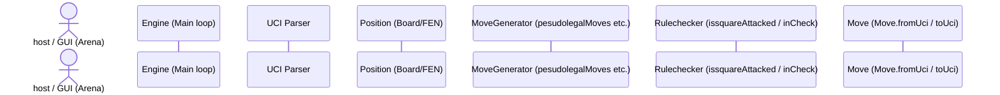

# chessGPTChessEngine

author: Kaung Nyi Naing

demo in class

```mermaid
sequenceDiagram
    autonumber
    actor host as host / GUI (Arena)
    participant Engine as Engine (Main loop)
    participant Parser as UCI Parser
    participant Position as Position (Board/FEN)
    participant MoveGen as MoveGenerator (pesudolegalMoves etc.)
    participant Rule as Rulechecker (issquareAttacked / inCheck)
    participant MoveObj as Move (Move.fromUci / toUci)


```

